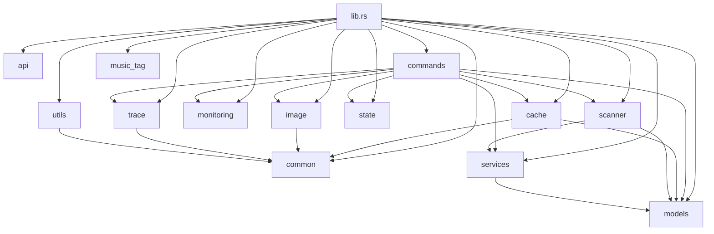

# Tauri 目录结构文档

## 1. 目录结构概览

```
src-tauri/src/
├── main.rs                 # 应用入口点
├── lib.rs                  # 库入口点
├── api/                    # API 相关模块
│   ├── mod.rs
│   └── http_proxy.rs       # HTTP 代理功能
├── cache/                  # 缓存相关模块
│   ├── mod.rs
│   ├── music_library_cache.rs
│   └── resource_cache.rs
├── commands/               # Tauri IPC 命令
│   ├── mod.rs
│   ├── cache_commands.rs
│   ├── directory_commands.rs
│   ├── image_commands.rs
│   ├── music_commands.rs
│   └── window_commands.rs
├── common/                 # 通用功能
│   ├── mod.rs
│   ├── constants.rs
│   └── utils.rs
├── image/                  # 图像处理模块
│   ├── mod.rs
│   ├── image_processor.rs
│   ├── gpu_image_processor.rs
│   └── shaders/            # 着色器文件
│       └── resize.wgsl
├── models/                 # 数据模型
│   ├── mod.rs
│   ├── album.rs
│   ├── artist.rs
│   ├── legacy.rs
│   └── track.rs
├── monitoring/             # 监控相关模块
│   ├── mod.rs
│   └── performance_monitor.rs
├── scanner/                # 音乐扫描模块
│   ├── mod.rs
│   └── incremental_scanner.rs
├── services/               # 服务模块
│   ├── mod.rs
│   ├── deduplication.rs
│   ├── persistence.rs
│   └── scanner.rs
├── state/                  # 应用状态
│   ├── mod.rs
│   └── app_state.rs
├── trace/                  # 追踪系统
│   ├── mod.rs
│   └── trace.rs
└── utils/                  # 工具函数
    ├── mod.rs
    └── music_deduplicator.rs
```

## 2. 目录功能说明

### 2.1 核心目录

- **main.rs**：应用的入口点，调用 `blurlyric_lib::run()` 启动应用
- **lib.rs**：库的入口点，定义模块结构和公共 API

### 2.2 功能模块目录

#### api/
- **功能**：包含 HTTP 代理等 API 相关功能
- **文件**：
  - `http_proxy.rs`：提供 HTTP 请求代理功能，避免 CORS 问题

#### cache/
- **功能**：包含音乐库缓存和资源缓存功能
- **文件**：
  - `music_library_cache.rs`：音乐库缓存管理
  - `resource_cache.rs`：资源缓存管理

#### commands/
- **功能**：包含所有 Tauri IPC 命令
- **文件**：
  - `cache_commands.rs`：缓存管理命令
  - `directory_commands.rs`：目录管理命令
  - `image_commands.rs`：图片处理命令
  - `music_commands.rs`：音乐查询命令
  - `window_commands.rs`：窗口管理命令

#### common/
- **功能**：包含通用常量和工具函数
- **文件**：
  - `constants.rs`：通用常量定义
  - `utils.rs`：通用工具函数

#### image/
- **功能**：包含图像处理相关功能，包括 CPU 和 GPU 处理
- **文件**：
  - `image_processor.rs`：CPU 图像处理
  - `gpu_image_processor.rs`：GPU 图像处理
  - `shaders/`：着色器文件目录

#### models/
- **功能**：包含数据模型定义
- **文件**：
  - `album.rs`：专辑模型
  - `artist.rs`：艺术家模型
  - `legacy.rs`：遗留数据模型
  - `track.rs`：曲目模型

#### monitoring/
- **功能**：包含性能监控功能
- **文件**：
  - `performance_monitor.rs`：性能监控实现

#### scanner/
- **功能**：包含音乐扫描相关功能
- **文件**：
  - `incremental_scanner.rs`：增量扫描实现

#### services/
- **功能**：包含各种服务功能
- **文件**：
  - `deduplication.rs`：音乐去重服务
  - `persistence.rs`：持久化服务
  - `scanner.rs`：扫描服务

#### state/
- **功能**：包含应用状态管理
- **文件**：
  - `app_state.rs`：应用状态实现

#### trace/
- **功能**：包含追踪系统
- **文件**：
  - `trace.rs`：来源追踪机制实现

#### utils/
- **功能**：包含各种工具函数
- **文件**：
  - `music_deduplicator.rs`：音乐去重工具

## 3. 模块依赖关系



## 4. 代码组织最佳实践

### 4.1 模块设计原则

1. **单一职责**：每个模块只负责一个功能领域
2. **高内聚**：模块内部的代码紧密相关
3. **低耦合**：模块间的依赖关系尽可能简单
4. **可测试性**：模块设计便于单元测试
5. **可扩展性**：模块设计支持未来功能扩展

### 4.2 文件命名规范

- **模块文件**：使用蛇形命名法（snake_case）
- **文件名**：应清晰反映文件的功能
- **mod.rs**：每个目录都应有一个 mod.rs 文件，用于导出模块

### 4.3 代码风格

- 遵循 Rust 官方代码风格
- 使用 `rustfmt` 格式化代码
- 添加适当的文档注释
- 错误处理应清晰明确

### 4.4 依赖管理

- 尽量减少模块间的循环依赖
- 使用 `pub` 关键字控制模块的公共 API
- 优先使用模块化设计，避免大型文件

## 5. 目录结构优势

1. **模块化**：每个模块职责明确，边界清晰
2. **可维护性**：代码组织更加清晰，便于维护
3. **可扩展性**：新功能可以轻松添加到相应的目录中
4. **可读性**：开发人员可以快速找到所需的代码
5. **符合 Rust 最佳实践**：遵循 Rust 项目的标准目录结构

## 6. 未来扩展建议

1. **添加测试目录**：为每个模块添加单元测试
2. **添加文档目录**：为复杂模块添加详细文档
3. **添加配置目录**：集中管理应用配置
4. **添加插件目录**：支持插件系统

## 7. 总结

新的目录结构按照功能模块清晰划分，遵循 Rust 项目的最佳实践，提高了代码的可读性、可维护性和可扩展性。通过合理的模块划分和依赖管理，使得代码结构更加清晰，便于团队协作和未来功能扩展。