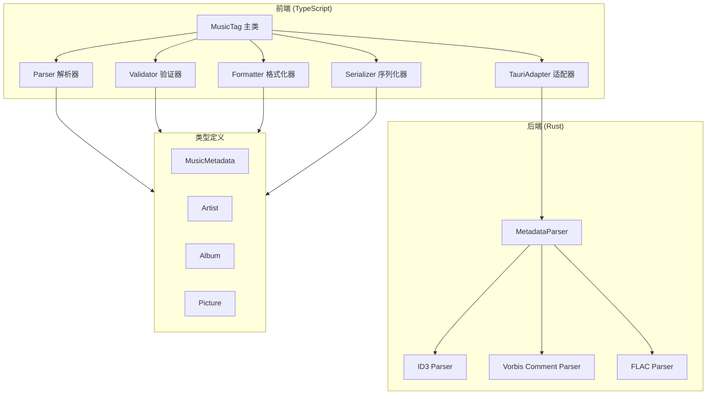
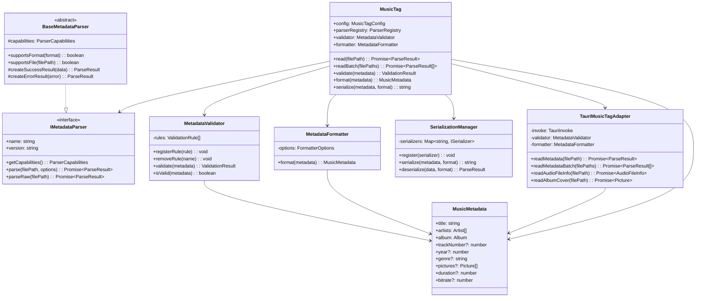
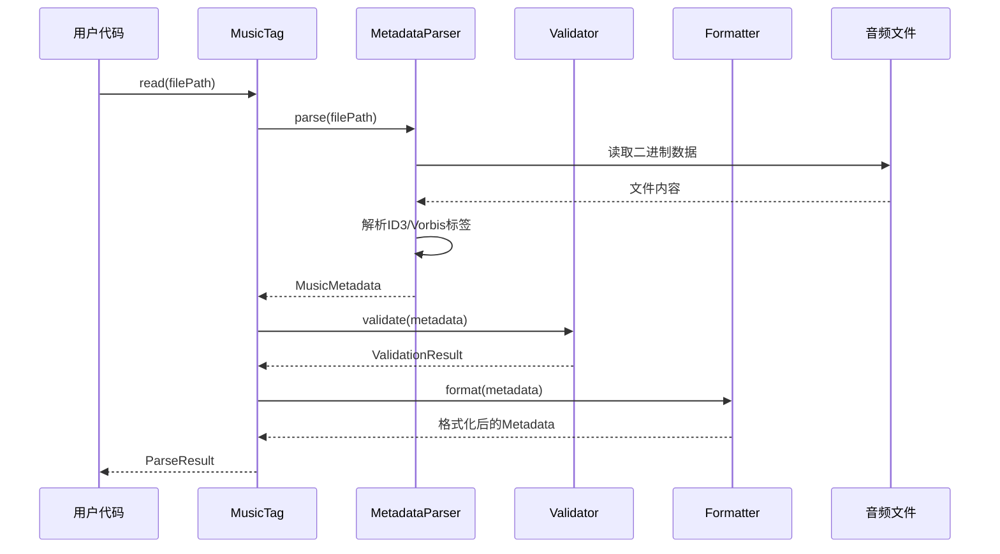
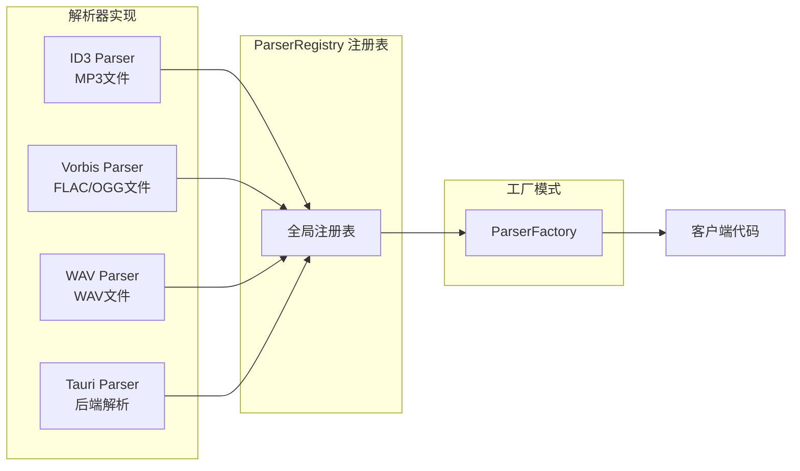
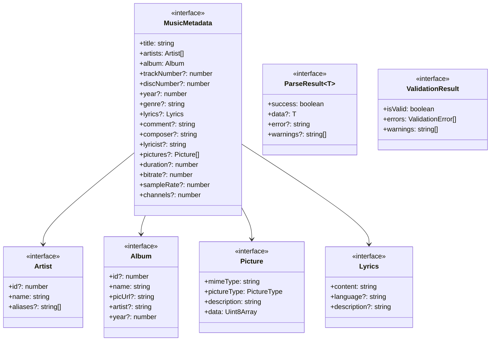
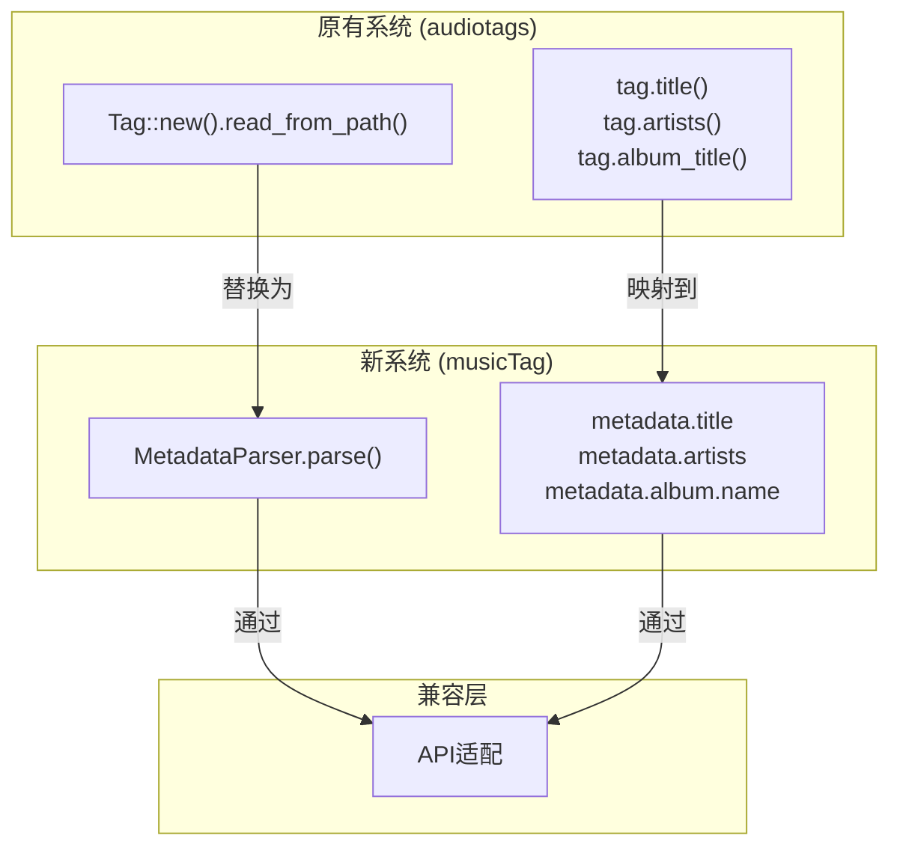

# MusicTag 模块架构文档

本文档详细描述 musicTag 模块的架构设计和组件关系。

## 架构概览



## 模块结构



## 数据流



## 解析器架构



## 组件职责

### 前端组件 (TypeScript)

| 组件 | 职责 | 关键类/接口 |
|------|------|------------|
| **MusicTag** | 主入口类，提供统一API | `MusicTag` |
| **Parser** | 解析器接口和注册表 | `IMetadataParser`, `ParserRegistry` |
| **Validator** | 元数据验证 | `MetadataValidator`, `ValidationRule` |
| **Formatter** | 元数据格式化 | `MetadataFormatter` |
| **Serializer** | 序列化/反序列化 | `ISerializer`, `SerializationManager` |
| **TauriAdapter** | Tauri后端适配 | `TauriMusicTagAdapter` |

### 后端组件 (Rust)

| 组件 | 职责 | 关键结构体/特性 |
|------|------|----------------|
| **MetadataParser** | 主解析器 | `MetadataParser` |
| **ID3 Parser** | ID3v1/ID3v2标签解析 | `parse_id3v1`, `parse_id3v2` |
| **Vorbis Parser** | Vorbis Comment解析 | `parse_vorbis_comment` |
| **FLAC Parser** | FLAC元数据块解析 | `parse_flac` |
| **Error Handling** | 错误处理 | `MusicTagError` |

## 类型系统



## 扩展点

模块提供了多个扩展点，便于功能扩展：

### 1. 自定义解析器


### 2. 自定义验证规则


### 3. 自定义序列化器


## 与原有系统的兼容性



## 目录结构

```
src/music_tag/
├── src/
│   ├── types.ts          # 核心类型定义
│   ├── parser.ts         # 解析器接口和基础实现
│   ├── validator.ts      # 验证和格式化
│   ├── serializer.ts     # 序列化和反序列化
│   ├── tauriAdapter.ts   # Tauri 适配器
│   ├── index.ts          # 主入口
│   └── __tests__/        # 单元测试
│       ├── types.test.ts
│       ├── validator.test.ts
│       └── serializer.test.ts
├── README.md             # 使用文档
├── EXAMPLES.md           # 使用示例
└── ARCHITECTURE.md       # 架构文档

src-tauri/src/music_tag/
├── mod.rs                # 模块入口
├── types.rs              # Rust类型定义
├── parser.rs             # Rust解析器实现
└── error.rs              # 错误处理
```

## 设计原则

1. **单一职责原则 (SRP)**: 每个组件只负责一个功能
2. **开闭原则 (OCP)**: 对扩展开放，对修改关闭
3. **依赖倒置原则 (DIP)**: 依赖抽象而非具体实现
4. **接口隔离原则 (ISP)**: 使用细粒度接口
5. **里氏替换原则 (LSP)**: 子类可替换父类

## 性能考虑

- **懒加载**: 图片和歌词按需解析
- **批量处理**: 支持批量读取减少I/O
- **缓存机制**: 可配置的结果缓存
- **异步处理**: 所有I/O操作均为异步

## 安全性

- **输入验证**: 所有输入都经过验证
- **错误处理**: 完善的错误处理机制
- **资源管理**: 自动资源清理
- **类型安全**: 完整的类型检查
